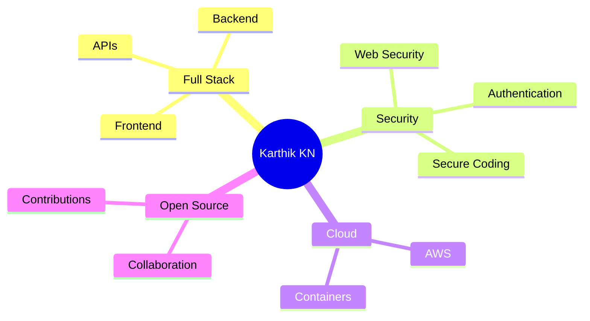

<!-- ========================================= -->

<!--      KARTHIK KN | FUTURE TECH PROFILE     -->

<!-- ========================================= -->

<div align="center">


</div>

<div align="center">

# 👋 Welcome to My Digital Universe


</div>

---

# 🌌 About Me


```yaml
name: Karthik KN

role: Full Stack Developer

interests:
  - Frontend Development
  - Backend Engineering
  - Cybersecurity
  - Open Source
  - Software Architecture

currently_learning:
  - Modern Frameworks
  - Security Practices
  - Scalable Systems
  - Cloud Technologies

goal:
  Build secure, scalable and impactful products.

motto:
  Build → Secure → Scale → Repeat
```

---

# 🚀 Mission Control

<table>
<tr>
<td width="50%">

### 🎯 Current Focus

* 🌱 Mastering Full Stack Development
* 🔐 Improving Security Knowledge
* 🚀 Building Production Projects
* 📚 Learning Modern Technologies
* 🌍 Contributing to Open Source

</td>

<td width="50%">

### ⚡ 2026 Goals

* [ ] 1000+ Contributions
* [ ] Major Open Source Contributions
* [ ] SaaS Product Launch
* [ ] Advanced System Design
* [ ] Cloud Infrastructure Skills
* [ ] Security Specialization

</td>
</tr>
</table>

---

# 🛠 Tech Arsenal

<div align="center">


</div>

<br>

<div align="center">

| Frontend   | Backend   | Database | Tools   |
| ---------- | --------- | -------- | ------- |
| HTML       | Node.js   | MongoDB  | Git     |
| CSS        | Express   | MySQL    | GitHub  |
| JavaScript | REST APIs | SQL      | Linux   |
| React      | Python    | NoSQL    | VS Code |

</div>

---

# 🌍 Connect With Me

<div align="center">

<a href="https://github.com/karthik-cyberexpert">

</a>

<a href="https://linkedin.com/in/YOUR_LINKEDIN">

</a>

<a href="https://twitter.com/YOUR_USERNAME">

</a>

<a href="mailto:YOUR_EMAIL">

</a>

<a href="https://YOUR_PORTFOLIO.com">

</a>

</div>

---

# 📊 GitHub Analytics

<div align="center">


</div>

---

# 🔥 Contribution Streak

<div align="center">


</div>

---

# 📈 Contribution Activity

<div align="center">


</div>

---

# 🏆 Achievement Gallery

<div align="center">


</div>

---

# 🧠 Developer Matrix

```text
Frontend Development      ██████████  95%

Backend Development       █████████░  90%

Cyber Security            ████████░░  80%

Database Design           ████████░░  80%

DevOps                    ██████░░░░  60%

Cloud Computing           ██████░░░░  60%

System Design             ███████░░░  70%

Problem Solving           █████████░  90%
```

---

# ⚡ GitHub Summary

<div align="center">


</div>

---

# 🌐 Contribution Heatmap

<div align="center">


</div>

---

# 🚀 Featured Repository

Replace below with your best repository:

```text
🔗 YOUR_TOP_REPOSITORY
```

Example:

```text
🔗 https://github.com/karthik-cyberexpert/project-name
```

---

# 🔐 Cybersecurity Lab

### Areas of Interest

* Web Security
* Secure Coding Practices
* Authentication Systems
* Security Awareness
* Vulnerability Assessment Fundamentals
* OWASP Top 10

---

# 📚 Learning Roadmap



---

# 🎮 Fun Terminal

```bash
$ whoami

Karthik KN

$ occupation

Full Stack Developer

$ passion

Building Projects

$ secondary_focus

Cybersecurity

$ status

Learning Something New Every Day 🚀
```

---

# 🐍 Contribution Snake

> Enable GitHub Action first.

```html

```

Workflow:

https://github.com/Platane/snk

---

# 👀 Profile Visitors

<div align="center">


</div>

---

# 💡 Philosophy

<div align="center">

### "Technology creates impact when innovation, security and usability work together."

</div>

---

<div align="center">

## ⭐ Thanks for Visiting My Profile


</div>
